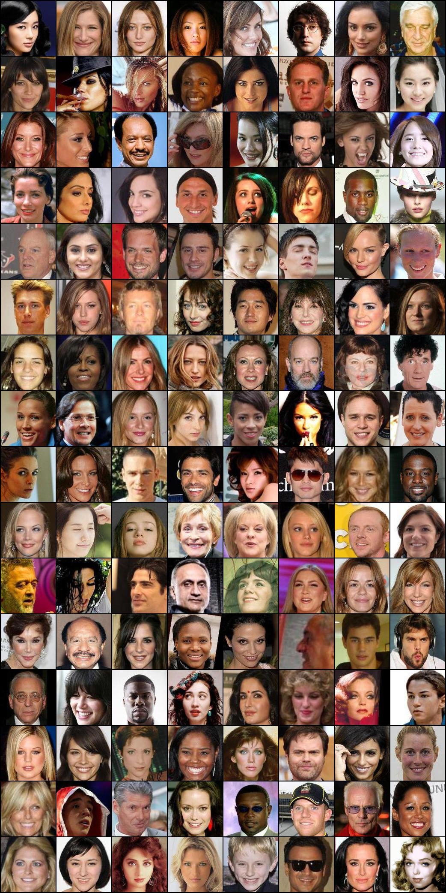
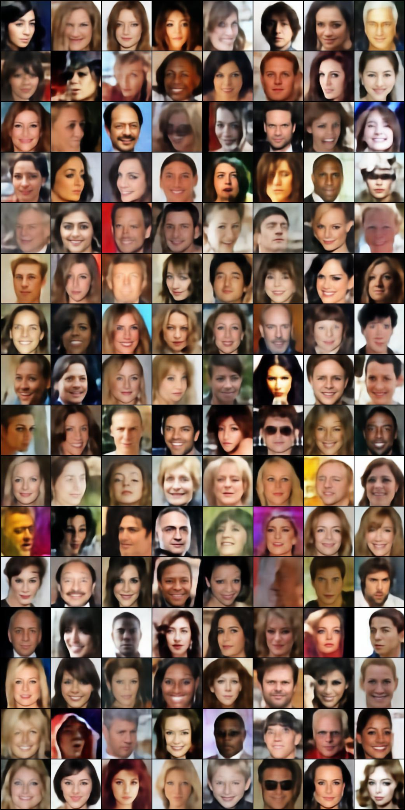
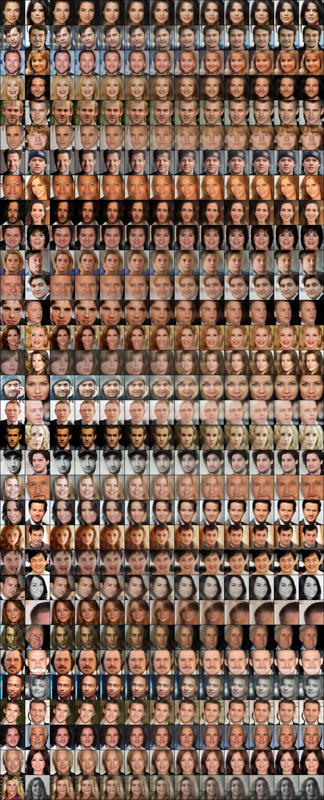
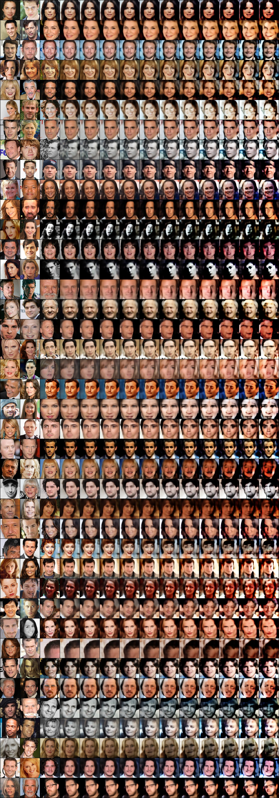

# Variational Autoencoder for face image generation in PyTorch
Variational Autoencoder for face image generation implemented with PyTorch, Trained over a combination of CelebA + FaceScrub + JAFFE datasets.

Based on Deep Feature Consistent Variational Autoencoder (https://arxiv.org/abs/1610.00291 | https://github.com/houxianxu/DFC-VAE)

TODO: Add DFC-VAE implementation

Pretrained model available at https://drive.google.com/open?id=0B4y-iigc5IzcTlJfYlJyaF9ndlU

## Results
Original Faces vs. Reconstructed Faces:

	
  

Linear interpolation between two face images:

	

Vector arithmatic in latent space:

	

